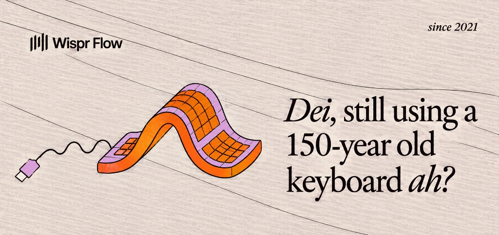

# Partly 🏖️🎶

> A high-performance 3D multiplayer virtual beach concert platform built with React, Three.js, and Supabase Realtime.



---

## 🌟 Overview

**Partly** is a 3D web-based social music festival and beach venue. Players create avatars, join rooms in real time, explore tropical beach islands, chat, dance, and watch synchronized concert stage video performances.

### Key Highlights
- **Interactive 3D Concert World**: Built with Three.js featuring custom low-poly shaders, dynamic day/night post-processing with UnrealBloomPass, real-time wave simulation, and spatial sound effects.
- **Synchronized Video Stage**: Ultra-low latency YouTube concert stream preview embedded into the 3D stage with CSS3DRenderer hole-punch shaders and sound visualizers.
- **Real-time Multiplayer Presence**: Synchronized player movement, animations (dancing, cheering, waving, sitting), and chat via Supabase Realtime Channels.
- **Curated Festival Environment**: Palm-fringed beaches, interactive tiki stalls, sun loungers, lifeguards, DJ mixer booth with glowing vinyl turntables, and marketing billboards.
- **Enterprise-Grade Security**: Cryptographically verified stage controls (SHA-256), sanitized URL parsers, and protected client secrets.

---

## 🛠️ Architecture & Tech Stack

| Layer | Technologies |
|---|---|
| **Core Framework** | React 18, TypeScript, Vite |
| **3D Engine** | Three.js (r184), EffectComposer, UnrealBloomPass, CSS3DRenderer |
| **Realtime & Multiplayer** | Supabase Realtime Presence & Broadcast Channels |
| **Styling & UI** | Tailwind CSS v4, Motion (Framer Motion), Sonner |
| **Audio** | Web Audio API (Synthesized spatial sound effects) |

---

## 📁 Project Structure

```text
partly/
├── public/                 # Static assets (Favicons, high-res billboard textures)
├── src/
│   ├── app/
│   │   ├── components/     # Core application UI & 3D viewports
│   │   │   ├── ChatPanel.tsx     # Real-time chat & crowd message stream
│   │   │   ├── HUD.tsx           # Player stats, sound controls & emotes
│   │   │   ├── LandingPage.tsx   # Cyberpunk lobby & room selection
│   │   │   ├── PartyScene.tsx    # Scene coordinator & stage controls
│   │   │   ├── ThreeCanvas.tsx   # 3D canvas, avatars, stage & physics
│   │   │   └── useMultiplayer.ts # Supabase Realtime hooks & presence
│   │   └── App.tsx         # Root application router & toaster
│   ├── styles/             # Modular typography & Tailwind tokens
│   ├── utils/              # Supabase client singleton & environment helpers
│   └── main.tsx            # Application entry point
├── supabase/               # Optional Edge functions & Deno socket workers
├── .env.example            # Environment template
└── vite.config.ts          # Optimized Vite bundler configuration
```

---

## 🚀 Getting Started

### Prerequisites
- **Node.js**: v18.0.0 or higher
- **npm** or **pnpm**

### Installation

1. **Clone the repository**:
   ```bash
   git clone https://github.com/ashubrothaaa007/partly.git
   cd partly
   ```

2. **Install dependencies**:
   ```bash
   npm install
   ```

3. **Configure Environment Variables**:
   Copy `.env.example` to `.env`:
   ```bash
   cp .env.example .env
   ```
   Provide your Supabase project credentials in `.env`:
   ```env
   VITE_SUPABASE_PROJECT_ID=your_supabase_project_id
   VITE_SUPABASE_ANON_KEY=your_supabase_anon_key
   ```

4. **Start Development Server**:
   ```bash
   npm run dev
   ```
   Open [http://localhost:5173](http://localhost:5173) in your browser.

5. **Build for Production**:
   ```bash
   npm run build
   ```

---

## 🎮 Controls

| Action | Key / Input |
|---|---|
| **Move** | `W`, `A`, `S`, `D` or Arrow Keys |
| **Jump** | `Space` |
| **Rotate Camera** | Click & Drag Mouse |
| **Dance** | `C` |
| **Wave** | `V` |
| **Cheer** | `B` |
| **Sit / Rest** | `N` (near chairs/benches) |
| **Chat** | `Enter` or click Chat box |

---

## 🔒 Security Best Practices

- **Zero Client-Side API Leakage**: No administrative master keys or service roles are bundled into client distribution artifacts.
- **Stage Lock**: Changing the concert video requires cryptographic SHA-256 verification of the stage admin passphrase.
- **Sanitized Video IDs**: Strict regex filtering prevents arbitrary iframe execution.

---

## 📄 License

MIT © [Partly](https://github.com/ashubrothaaa007/partly)